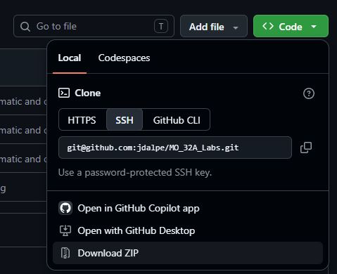
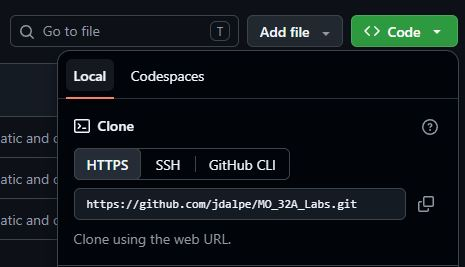

# Laboratoire 1 / Partie 1


## Partie 1:
- Comprendre comment accéder au Github


# GitHub

GitHub est un ensemble de Git Repository. Il y a 3 platformes principales pour les projets de type 'open-source'. 

- https://gitlab.com/
	- GitLab est une compagnie.
- https://bitbucket.org/
	- Bitbucket appartient à Atlassian, une compagnie très présente en informatique, ils ont aussi la plateform JIRA qui est rendu un 'must' en développement logiciel.
- https://github.com/
	- Acheté par Microsoft, c'est la plateforme la plus grande des 3.

#### Comment utiliser le Git Repo pour le cours? 

Vous avez 3 façons d'utiliser la plateforme. Via le web, en copie local ou en git local.

Pour visualiser les README.md, utiliser la plateforme Web, les images seront directement affiché et vous n'aurez pas à 'chercher' ce que les commandes dans le README.

Pour télécharger les informations (Le code ET le document de questions), utiliser le git local. Il est possible d'utiliser la copie local, mais c'est une bonne habitude d'utiliser Git directement.

-----

## Plateforme Web

Voici l'arborescence des fichiers / Le File Tree


En cliquant sur un fichier dans le navigateur, par défaut, le README sera affiché.


> $\color{gray}{\text{MANIPULATION}}$ **Naviguer dans GitHub**
> 
> Naviguer dans l'arbre des fichiers et trouver ou se trouve les 
> images dans ce README.
> 

-----

## Copy local

À tout moment, un Git Repo peut être copier d'un GitHub/GitLab/BitBucket.

- Allez dans l'onglet `code`



- Sélectionner `Download ZIP`

- Dézipper pour avoir la copie de la branche `main`
	- Si vous avez une mise à jour, le fochier doit être téléchargé à nouveau

-----

## Git Local

Pour utiliser Git, il faut télécharger au minimum d'outils en ligne de commande. 

https://git-scm.com/install/windows


Pour visualiser la structure Git avec un interface, il faut aussi un autre programme.

https://git-scm.com/downloads/guis?os=windows

- Il y a un ensemble de choix pour votre OS, je conseille:
	- GitHub Desktop: Pour les projets GitHub exclusif
	- Git Extensions: Pour les utilisateurs de Windows
	- git-cola: Pour les utilisateurs de Linux et MacOS


> $\color{gray}{\text{MANIPULATION}}$ **Installer Git**
> 
> Installer Git sur votre ordinateur. 
> Vous aurez accès à l'outils `Git Bash` ainsi qu'à `Git GUI`
> Pour ce laboratoire, nous allons utiliser le `BASH` uniquement
> 

Une fois Git installer, vous aurez une nouvelle fonction via le click-droit de votre souris:


Pour copier le Git Repo sur votre ordinateur, sélectionner `Git Bash`

Via la ligne de commande GIT (De type Linux). Cloner le Repo:

```
git clone https://github.com/jdalpe/MO_34A_Labs.git
```

Le lien du GitHub se trouve dans la section `HTTPS` du menu `clone`




> $\color{gray}{\text{MANIPULATION}}$ **Fetching**
> 
> Utiliser la commande Git et copier l'arbre du Repo sur votre ordinateur.
> 
> 

-----

##### Git Extensions

Si vous voulez essayer Git Extensions, l'interface sera aussi disponible via click-droit:


##### Mettre à jour le Git Repo

Pour suivre le développement actif des répertoires, vous pouvez simplement appliquer des `patch`. Une façon très simple est d'utiliser le `Git Bash` dans le fichier et d'écrire:

```
git pull
```

Pour une version plus précise, voici les commandes:

```
git fetch
git rebase origin/main
```


> $\color{gray}{\text{MANIPULATION}}$ **Pull et Fetch**
> 
> Utiliser cette commande si le Git Repo a été mis à jour en ligne. 
> Pour le savoir, on peut aussi utiliser la même commande et si le message
> est: `Already up-to-date`. Le tout était déjà à jour.
> 
> Pour un code `open-source`, il est conseiller d'utiliser cette commande 
> à chaque fois qu'on veut aussi le mettre à jour. Cela évite les conflits
> 