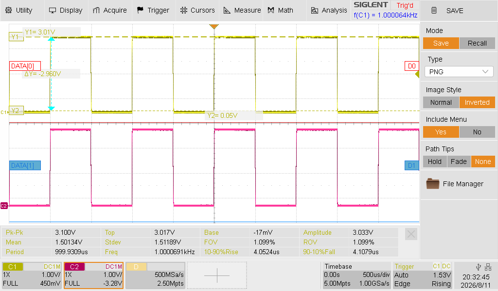
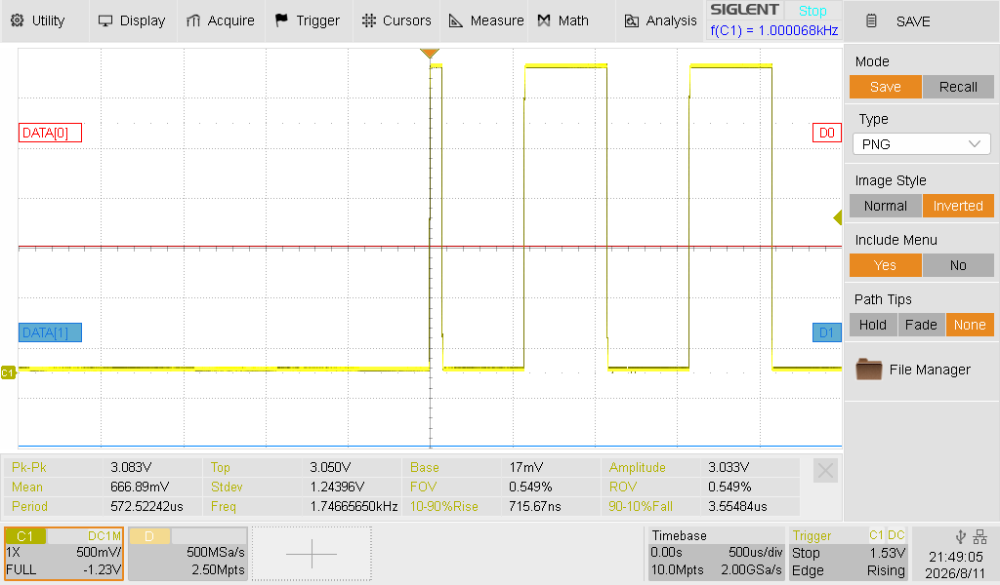

# Laboratoire 1 / Partie 2

## Partie 2:
- Multimètre et Analyse de signaux sur l'oscilloscope

# Multimètre

Durant la section théorique, nous avons discuté de l'utilité du multimètre. Cette section sera une division des fonctions utilisées ainsi que le déboggage utiliser.

### Beeper / Résistance minimale

Avant même de tout brancher, il est important de vérifier les court-circuits. Si une alimentation de 120V circule dans votre circuit, vous devez vous assurez l'isolation de celle-ci.

Si les pin/broches de vos ICs sont facile d'accès, vérifier s'il y a un court-circuit entre-elles.

Le filage extérieur est tout aussi important. Un court-circuit peut avoir un impact banale ou détruire votre projets...

Une mention spéciale pour les Diodes et DELs/LEDs: le mode en résistance minimal(beeper) est souvent la même option, mais vous pouvez vérifier la conductivité de la diode. Pour une DELs standard (3v/20mA), la lumière sera aussi active pendant votre test.

**TRÈS IMPORTANT**: Toujours mesurer la connectivité SANS alimentation. Pour ce mode, comme la trace ou le fil est actif, le `beeper` sera toujours activé.

### Voltage

**VOLTAGE AC**

Au moment de tester l'ensemble de circuit, s'il y a une section d'alimentation. **TOUJOURS** commencer par l'alimentation 120V.

$\color{darkyellow}{\text{IMPORTANT}}$ Ne jamais utiliser le multimètre pour un signal à plus de 200Hz, la valeur sera une moyenne (Le RMS), mais n'aura aucune certitude.

**VOLTAGE DC**

La tension se mesurent toujours en parallèle, pour savoir si votre circuit est fonctionnel ou connecter, c'est votre premier réflexe à avoir.

### Résistance / Resistor

Si vous savez exactement la valeur que vous recherchez, le mode résistance pourrait être fonctionnel. $\color{darkred}{\text{MAIS}}$ vous ne pouvez pas avoir la même d'une résistance isolée VS celle du circuit.

Un exemple assez simple serait un potentiomètre. Si celui-ci est brancher à un encoder ou même simplement une pin/broche d'un micro-contrôleur. La valeur sera ajuster par le branchement interne...

**TRÈS IMPORTANT**: Toujours mesurer la résistance SANS alimentation.

### Ampèrage / Current

Lire le courant est le plus difficile sur un circuit. Comme nous devons placer le tout en série, une trace de PCB ne pourra pas être utilisé. Que ce soit en DC ou en AC, assurez-vous d'avoir la bonne configuration pour votre courant. Un multimètre a des fusibles pour protéger l'électronique interne.

Il y en a généralement 2:

- Moins de 2A
	- Utiliser généralement au niveau des GPIO d'un micro-contrôleur et du courant `DC`.
- Moins de 10A
	- Utiliser généralement pour le `AC`.

**POURQUOI avoir 2 fuses??**

Les configurations avec moins d'ampère passe par un autre circuit qui donne des mesures plus précises. Ce circuit n'est pas aussi 'résistant' que la section de 10A. Certain multimètre auront même une prise dédiée pour la sonde.

# Oscilloscope

L'oscilloscope est un outil très puissant, il peut mesurer la phase d'une pin ou même lire des trames de protocoles. Il est cependant utiliser une fois que l'alimentation a été bien vérifier avec un multimètre. 

Les sondes d'oscilloscope ont une protection interne, mais tester le tout dans un environnement de court-circuit est une très mauvaise pratique.

Commençons par créer un signal test. Tous les oscilloscopes ont un générateur accessible pour un signal de base. 

Section `D`.

> $\color{gray}{\text{MANIPULATION}}$ **Signal test**
>
> Brancher une sonde dans la section `D` de l'oscilloscope.
> 
> - En haut pour la sonde
> - En bas pour la mise à la terre
> 
> Le signal devrait être de 0 à 3V en onde carré de 1kHz
> 
> Il y a aucun signal? Peser sur `Auto Setup`
> 
> Le signal n'est pas de 3V? Placer la sonde en mode X1 (Le sélecteur rouge sur la sonde)

## Division temps et tension

Les informations sur le signal se trouve en dessous de votre signal. 

Dans la section `B`, nous avons l'ensemble des options les plus utilisé pour modifier les signaux.

Nous avons la composante horizontale (Le temps) et la vertical (La tension)

#### Tension / Vertical

Le potentiomètre (knob) de V <-> mV est un outil utile pour contrôler la section prise par votre signal.

Le potentiomètre (knob) de Zero permet de contrôler l'emplacement.

> $\color{gray}{\text{MANIPULATION}}$ **2 Signaux**
>
> Brancher 2 sondes dans la section `D` de l'oscilloscope.
> 
> - En haut pour les sonde
> - En bas pour la mise à la terre
> 
> Le signal devrait être de 0 à 3V en onde carré de 1kHz
> 
> Avec la section vertical, placer 2 signaux non-superposés

## Touchscreen et curseurs

L'oscilloscope que vous avez vient avec un mode `touchscreen`, assurez-vous que le bouton `touch` est bien illuminé pour pouvoir l'utiliser.

L'ensemble des options avec boutons est disponible en mode `touchscreen`. Les curseurs sont très simple a visualiser avec cette option. 

Vous pouvez aussi utiliser l'écran pour bouger les curseurs, OU le potentiomètre (knob) `universal`.

> $\color{gray}{\text{MANIPULATION}}$ **Tension**
>
> Avec l'aide des curseur en `Y`, mesurer la tension du signal 1.
>
>

## Auto

Le bouton `Auto Setup` sera l'option le plus utile et le moins utile à la fois. Si vous ne trouvez pas votre signal, peser dessus et l'oscilloscope essayera de la trouver.

Si vous l'avez trouver, modifier toujours manuellement pour vos besoins. Dans le cadre de notre cours, les trames de données ou l'horloge du signals est souvent répéter. Utilser `Auto Setup` dans ce contexte fonctionne très bien pour 90% des cas.

## Trigger mode

Un `Trigger` c'est un point de référence. Il y a 3 modes:

- Normal: Le signal sera échantillionné en tout temps, mais sera sur pause quand la tension ne sera plus détecté.
- Single: Le signal sera échantillionné à partir d'un changement de tension (Rising/Falling Slope)
- Auto: Le signal sera échantillionné en tout temps, même en cas d'absence de voltage.

Le `Trigger` sera aussi sur un seul signal, par défaut sur `1`.

> $\color{gray}{\text{MANIPULATION}}$ **Trigger Single**
>
> Enlever les sondes des plaques `D`. (Garder le GND)
>
> Placer l'oscilloscope en mode trigger `Single`.
>
> Rebrancher la sonde.
>
> La flèche blue au dessus du graphique présente l'entrée du signal.
>

## Sauvegarder une image

L'ensemble des images ci-dessus ont été capturé sur l'oscilloscope. Pour sauvegarder une image:

- Brancher une clé USB dans un des 2 USBs
- Bouton `Save/Recall`
- Sélection:
	- Mode: save
	- Type: PNG ou JPG
	- Image style:
		- Normal pour fond noir
		- Inversed pour fond blanc
	- Include menu: Si vous voulez
	- Path tips: None
	- Ouvrir File Manager
- Naviguer à votre clé USB
- Appuyer sur `Save` pour un nom auto généré ou `Save As` pour avoir un clavier