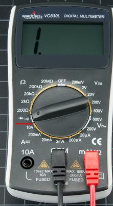
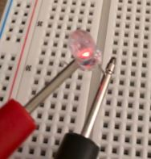
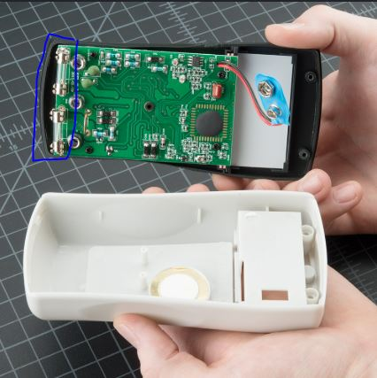
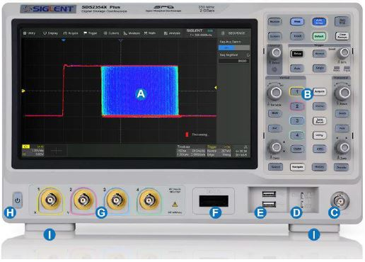

# Laboratoire 1 / Partie 2

## Partie 2:
- Multimètre et Analyse de signaux sur l'oscilloscope

# Multimètre

Durant la section théorique, nous avons discuté de l'utilité du multimètre. Cette section sera une division des fonctions utilisées ainsi que le déboggage utiliser.

### Beeper / Résistance minimale

Avant même de tout brancher, il est important de vérifier les court-circuits. Si une alimentation de 120V circule dans votre circuit, vous devez vous assurez l'isolation de celle-ci.

Si les pin/broches de vos ICs sont facile d'accès, vérifier s'il y a un court-circuit entre-elles.

Le filage extérieur est tout aussi important. Un court-circuit peut avoir un impact banale ou détruire votre projets...

Une mention spéciale pour les Diodes et DELs/LEDs: le mode en résistance minimal(beeper) est souvent la même option, mais vous pouvez vérifier la conductivité de la diode. Pour une DELs standard (3v/20mA), la lumière sera aussi active pendant votre test.

**TRÈS IMPORTANT**: Toujours mesurer la connectivité SANS alimentation. Pour ce mode, comme la trace ou le fil est actif, le `beeper` sera toujours activé.

### Voltage

**VOLTAGE AC**

Au moment de tester l'ensemble de circuit, s'il y a une section d'alimentation. **TOUJOURS** commencer par l'alimentation 120V.

$\color{darkyellow}{\text{IMPORTANT}}$ Ne jamais utiliser le multimètre pour un signal à plus de 200Hz, la valeur sera une moyenne (Le RMS), mais n'aura aucune certitude.

**VOLTAGE DC**

La tension se mesurent toujours en parallèle, pour savoir si votre circuit est fonctionnel ou connecter, c'est votre premier réflexe à avoir.

### Résistance / Resistor

Si vous savez exactement la valeur que vous recherchez, le mode résistance pourrait être fonctionnel. $\color{darkred}{\text{MAIS}}$ vous ne pouvez pas avoir la même d'une résistance isolée VS celle du circuit.

Un exemple assez simple serait un potentiomètre. Si celui-ci est brancher à un encoder ou même simplement une pin/broche d'un micro-contrôleur. La valeur sera ajuster par le branchement interne...

**TRÈS IMPORTANT**: Toujours mesurer la résistance SANS alimentation.

### Ampèrage / Current

Lire le courant est le plus difficile sur un circuit. Comme nous devons placer le tout en série, une trace de PCB ne pourra pas être utilisé. Que ce soit en DC ou en AC, assurez-vous d'avoir la bonne configuration pour votre courant. Un multimètre a des fusibles pour protéger l'électronique interne.

Il y en a généralement 2:

- Moins de 2A
	- Utiliser généralement au niveau des GPIO d'un micro-contrôleur et du courant `DC`.
- Moins de 10A
	- Utiliser généralement pour le `AC`.

**POURQUOI avoir 2 fuses??**

Les configurations avec moins d'ampère passe par un autre circuit qui donne des mesures plus précises. Ce circuit n'est pas aussi 'résistant' que la section de 10A. Certain multimètre auront même une prise dédiée pour la sonde.

# Oscilloscope

L'oscilloscope est un outil très puissant, il peut mesurer la phase d'une pin ou même lire des trames de protocoles. Il est cependant utiliser une fois que l'alimentation a été bien vérifier avec un multimètre. 

Les sondes d'oscilloscope ont une protection interne, mais tester le tout dans un environnement de court-circuit est une très mauvaise pratique.

Commençons par créer un signal test. Tous les oscilloscopes ont un générateur accessible pour un signal de base. 

Section `D`.

> $\color{gray}{\text{MANIPULATION}}$ **Signal test**
>
> Brancher une sonde dans la section `D` de l'oscilloscope.
> 
> - En haut pour la sonde
> - En bas pour la mise à la terre
> 
> Le signal devrait être de 0 à 3V en onde carré de 1kHz

## Division temps et tension

TODO: control signal size

## Interface principal

TODO: 1 signal or dual view ideal for triggers

## Auto

TODO: The magic and curse of auto

## Trigger mode

TODO: Must used mode: trigger on rising or falling
TODO: Size of signal

