# Laboratoire 1 / Partie 3

## Partie 3:
- Filage électrique et heatshrink (Gaine thermo)

# Outils et préparation

Préparer votre fer à souder:

- Mouiller votre éponge
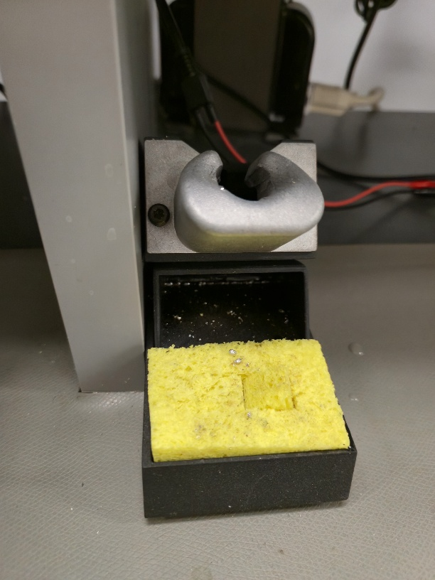

- Placer votre hotte de travail (Tube de ventilation)
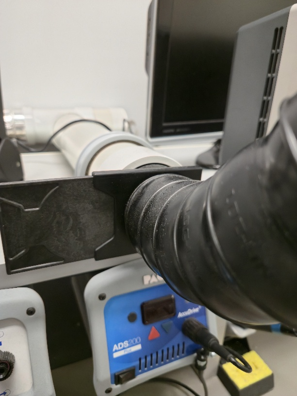

- Insérer votre pointe (Pour le cours du 21, embout **bleu**)
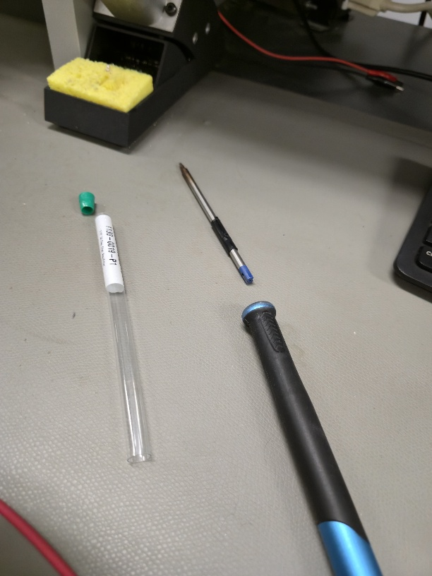

Seasonning:
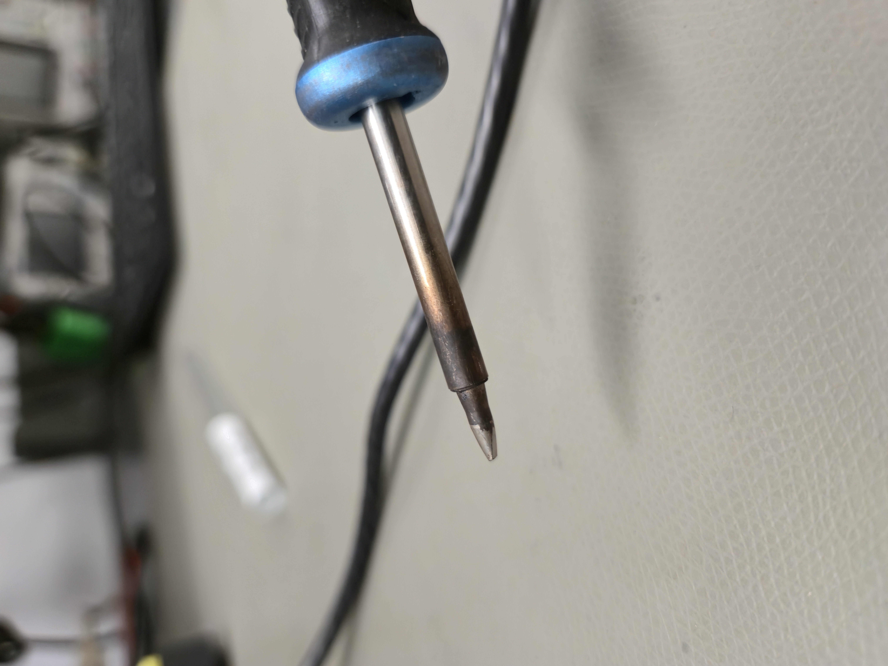
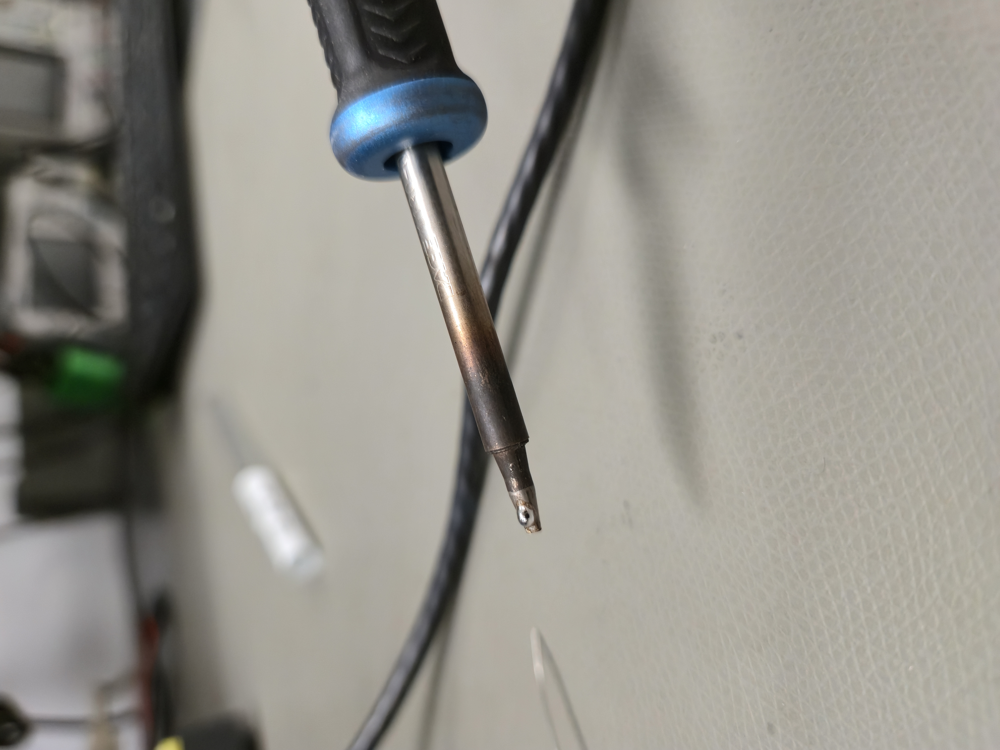
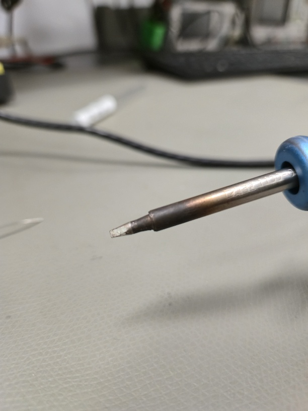
Préparer les 2 côtés pour faciliter la soudure

**NOTE** Les exemples ici seront sans flux, le but est de voir et de comprendre l'apposition de l'étain sur les divers type de configuration. Pour les prochains laboratoires, nous allons utiliser le flux pour `faciliter` cette étape. Votre étain utilise aussi un flux core (à 2.5%) qui aide au transfert de température.

# Méthode de fils Monobrin (Single core)

Le fil monobrin est plus difficile a travailler que le multibrin.

Voici ses avantages:

- Contact propre
- Court-circuit très rare
- Pour de la puissance plus grande pour la même grosseur

Quelques désavantages:

- Non malléable (Un choix de heatshrink plus grand est souvent nécessaire)
- Facile a mal dégainer le fil
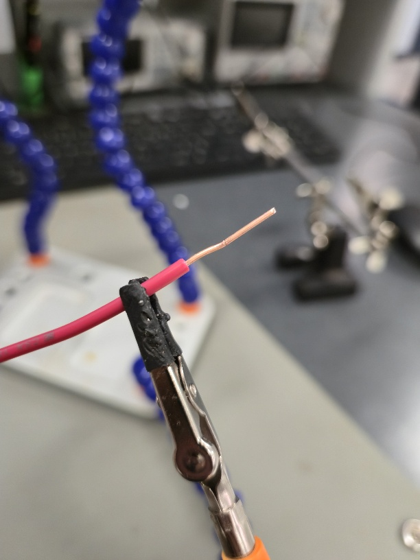

## Méthode Parallèle

Si on veut minimiser l'espace de réparation des fils, nous allons souder de façon parallèle.
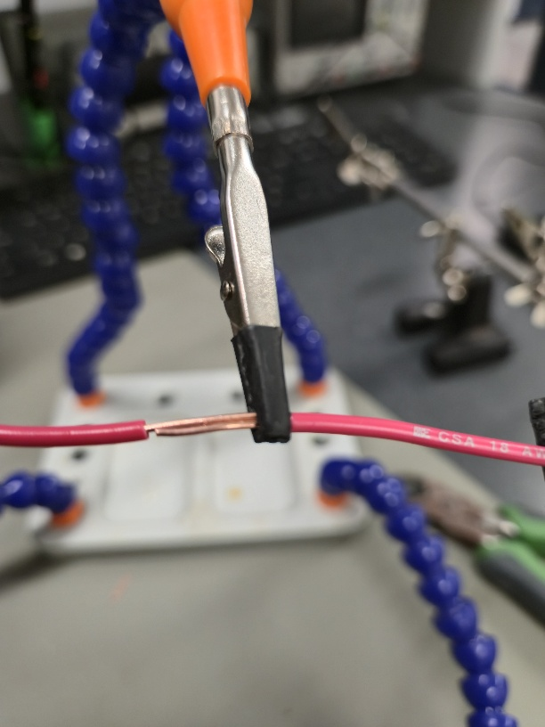

Sans enrouler le fil, l'espace utiliser sera minimal, mais la soudure se fera en 2 étapes:

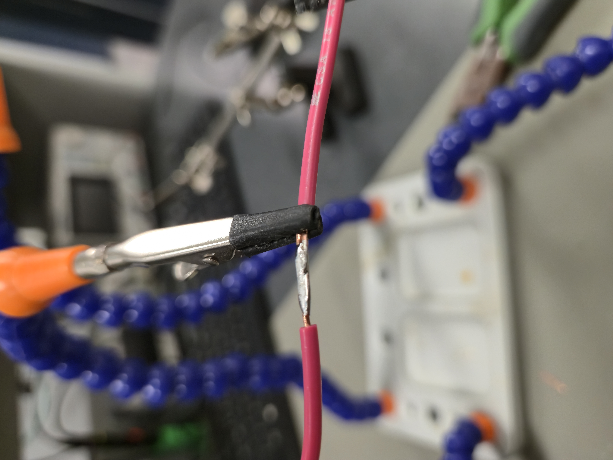

Et faire de l'autre côté:

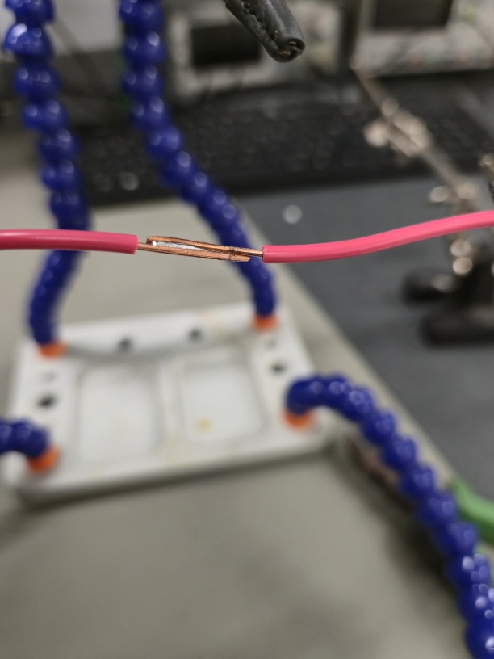

*IMPORTANT*: les 2 côtés seront nécessaire pour un `gauge` de cette taille ou plus grand. 

> $\color{gray}{\text{MANIPULATION}}$ **Soudure Mono Brin Parallèle**
> 
> Souder un fil via la méthode parallèle.
> 
> **ATTENTION** Quand vous soudez l'autre côté, toujours maintenir la pression en 
> place sur les 2 fils, sinon ils vont se séparer.
> 

> $\color{darkred}{\text{À VÉRIFIER}}$ **Soudure Mono Brin Parallèle**
>
> Montrer à l'enseignant le travail de soudure
>
>

Couvrir votre soudure avec une gaine thermo (heatshrink) est un standard de l'industrie, prenez la gaine **rouge** et **noire**.

> $\color{darkred}{\text{À VÉRIFIER}}$ **Heatshrink Mini brin parallèle**
> 
> Pouvez-vous installer la rouge? Sinon la noir. (Attendre que le fil soit moins chaud)
> 
> Utiliser le pistolet thermique sur la station de l'enseignant pour votre évaluation.
> 

## Méthode Perpendiculaire

Une méthode plus standard et plus facile a executer est sous forme de marette, on enroule les 2 bouts. On enroule a partir d'un angle de 90 degrées.

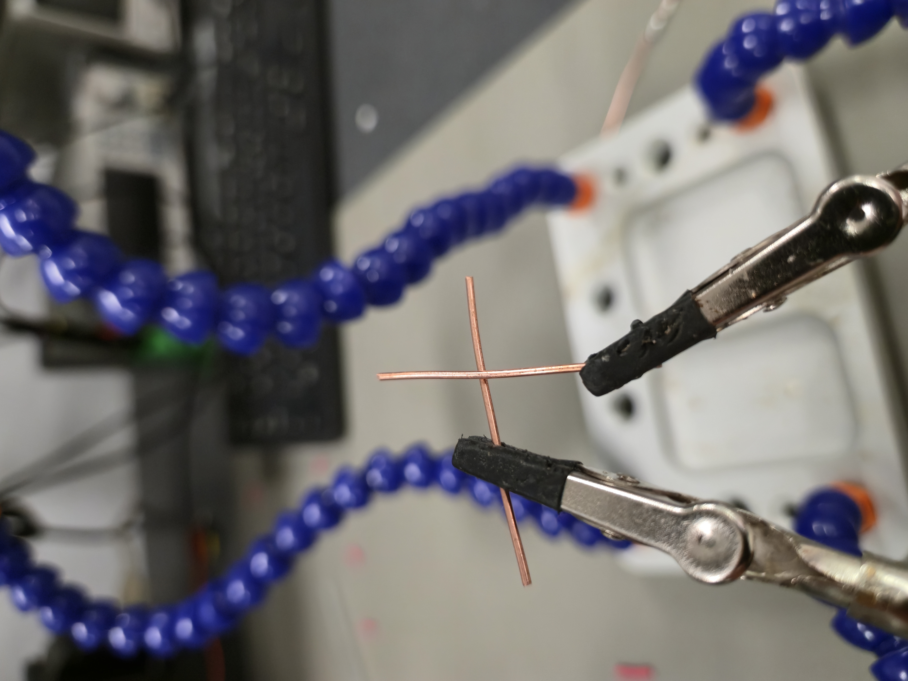

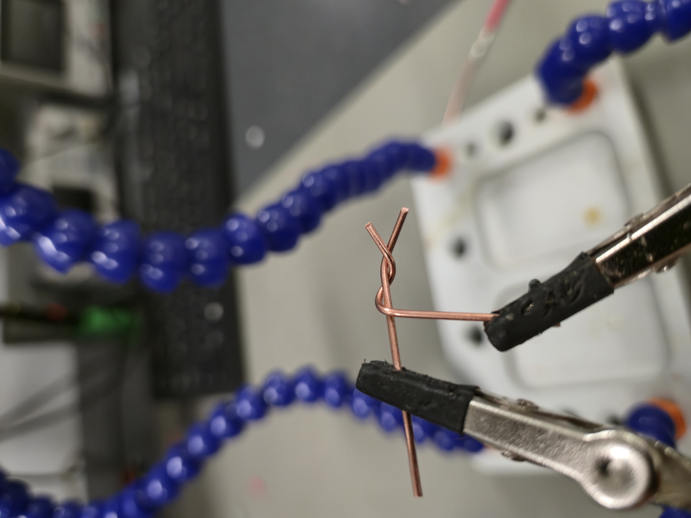

Voici un exemple avec le fil avec gaine:

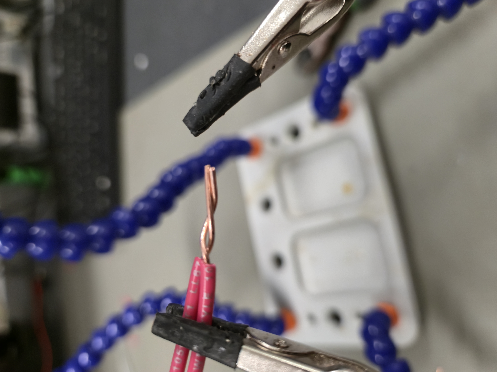

Placer une soudure uniforme et lisse

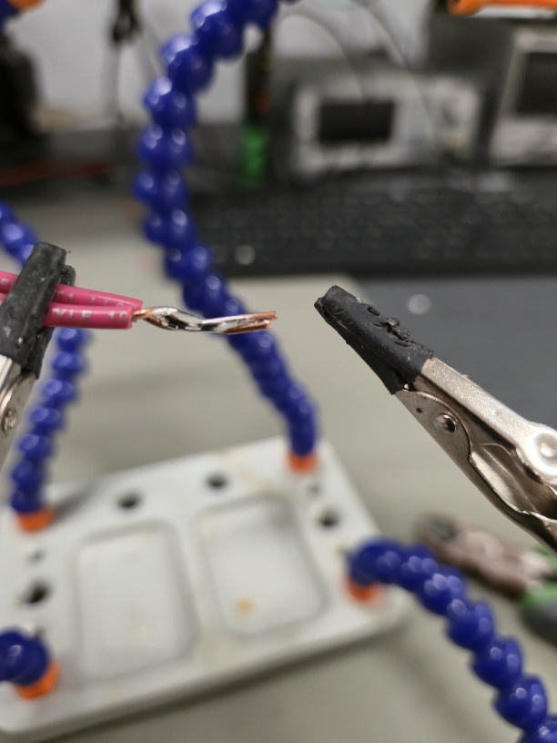

**Pour une solidité accru, utiliser l'autre côté aussi.**

> $\color{gray}{\text{MANIPULATION}}$ **Soudure Mono Brin Perpendiculaire**
> 
> Souder un fil via la méthode perpendiculaire
>

> $\color{darkred}{\text{À VÉRIFIER}}$ **Soudure Mono Brin Perpendiculaire**
>
> Montrer à l'enseignant le travail de soudure
>
>

> $\color{darkred}{\text{À VÉRIFIER}}$ **Heatshrink Mono brin Perpendiculaire**
> 
> Installer le noir
> 
> Utiliser le pistolet thermique sur la station de l'enseignant pour votre évaluation
> 

# Méthode de fils Multibrin (Multi core)

Le fil multibrin est un standard pour quelques types de connexion entre les circuits. Les batteries, par exemple, sont très souvent multibrin.

Voici quelques avantages:

- Beaucoup plus malléable
- Plus facile a adapter au circuit, les brins peuvent se placer plus facilement sur un PCB
- Seasoned un multi-core est très simple et souvent utiliser pour mieux adhérer

Le plus gros problème: Les court-circuits.. Les brins sont souvent TRÈS petit et peuvent se connecter facilement

## Méthode Parallèle

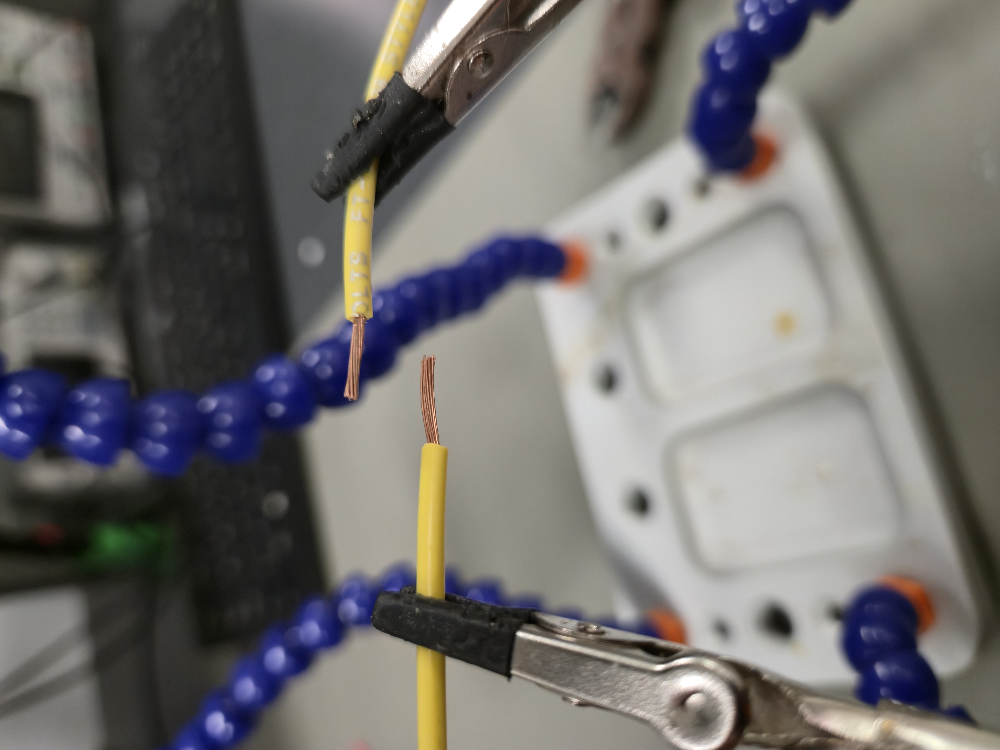

Bien enrouler les fils ensemble pour ne pas avoir de brin flottant. (Gauche - Enrouler / Droite - Flottant)

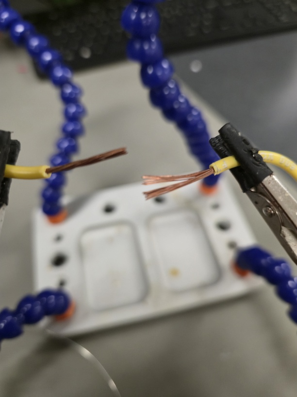

En parallèle, l'espace utiliser sera minimale, mais la soudure se fera en 3 étapes:

- Placer les fils parallèle

- Préparer le fil en le recouvrant d'étain

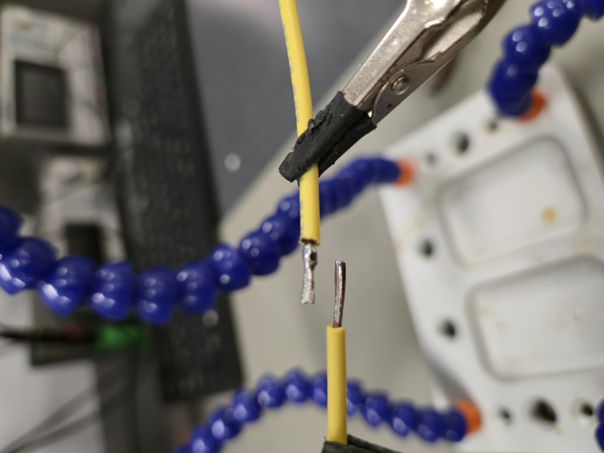

- Coller les 2 avec un soudure final

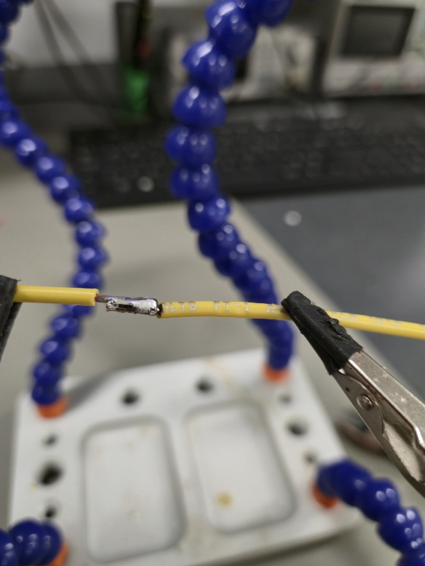

> $\color{gray}{\text{MANIPULATION}}$ **Soudure Multi Brin Parallèle**
> 
> Souder un fil via la méthode parallèle
> 

> $\color{darkred}{\text{À VÉRIFIER}}$ **Soudure Multi Brin Parallèle**
>
> Montrer à l'enseignant le travail de soudure
>
>

Couvrir la soudure avec une gaine thermo (heatshrink), prendre la gaine **noire**.

> $\color{darkred}{\text{À VÉRIFIER}}$ **Heatshrink Multi Brin en ligne**
> 
> Installe le heatshrink noir
> 
> Utiliser le pistolet thermique sur la station de l'enseignant pour votre évaluation
> 

## Méthode Perpendiculaire

- Enrouler les brins
- Enrouler les fils entre eux
- Souder la section croisée uniforme

Non-uniforme: $\color{darkred}{\text{À éviter}}$
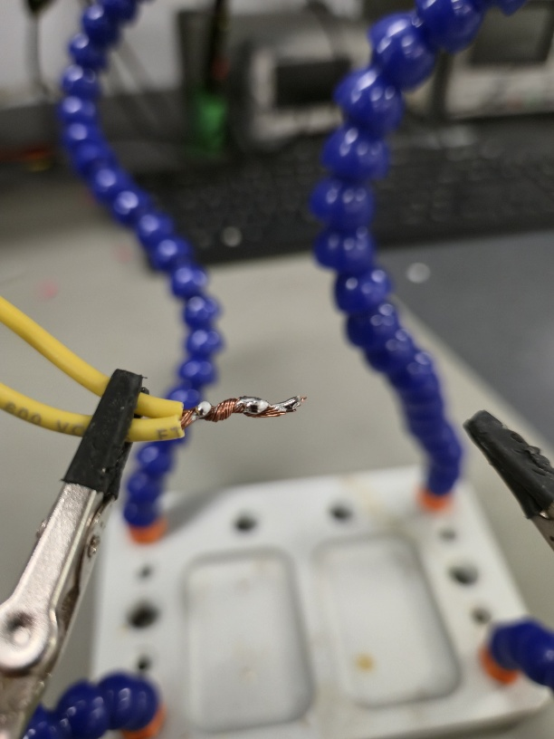

Uniforme: $\color{darkgreen}{\text{Idéal}}$
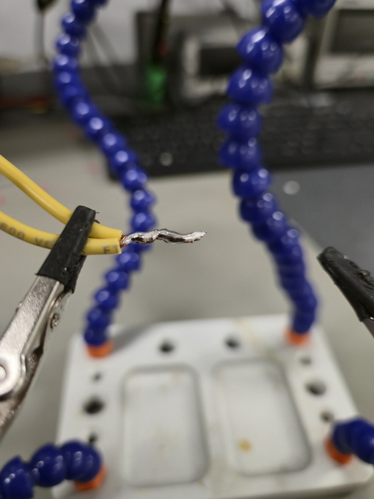

Toujours une bonne habitude de vérifier les 2 côtés (Surtout pour du gros calibre/`gauge`)

> $\color{gray}{\text{MANIPULATION}}$ **Soudure Multi Brin Perpendiculaire**
> 
> Souder un fil via la méthode perpendiculaire
>

> $\color{darkred}{\text{À VÉRIFIER}}$ **Soudure Multi Brin Perpendiculaire**
>
> Montrer à l'enseignant le travail de soudure
>
>

> $\color{darkred}{\text{À VÉRIFIER}}$ **Heatshrink Multi brin en marette**
> 
> Installer le noir
> 
> Utiliser le pistolet thermique sur la station de l'enseignant pour votre évaluation
> 

