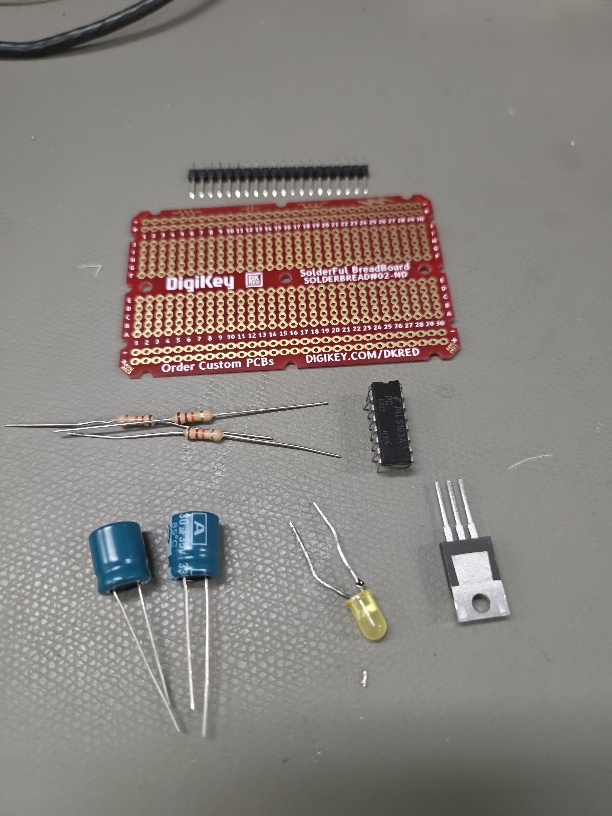
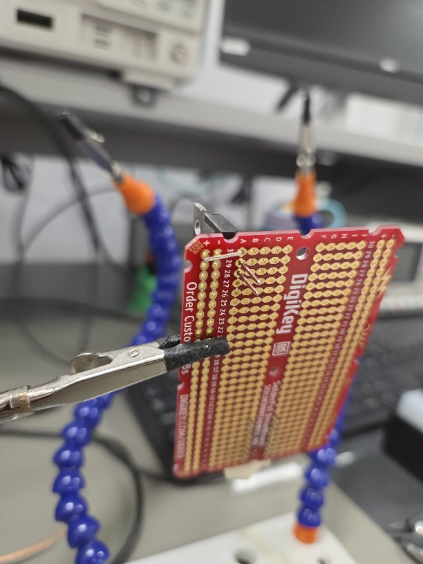
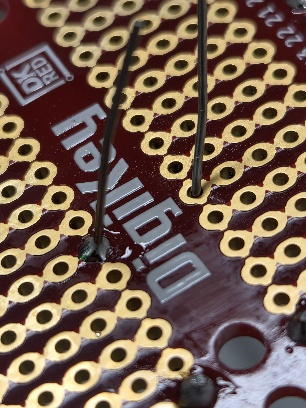
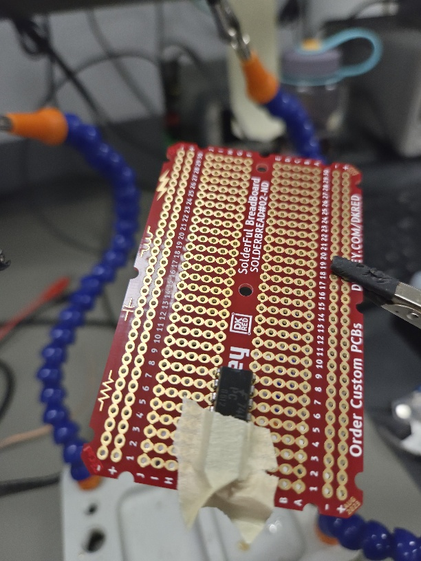
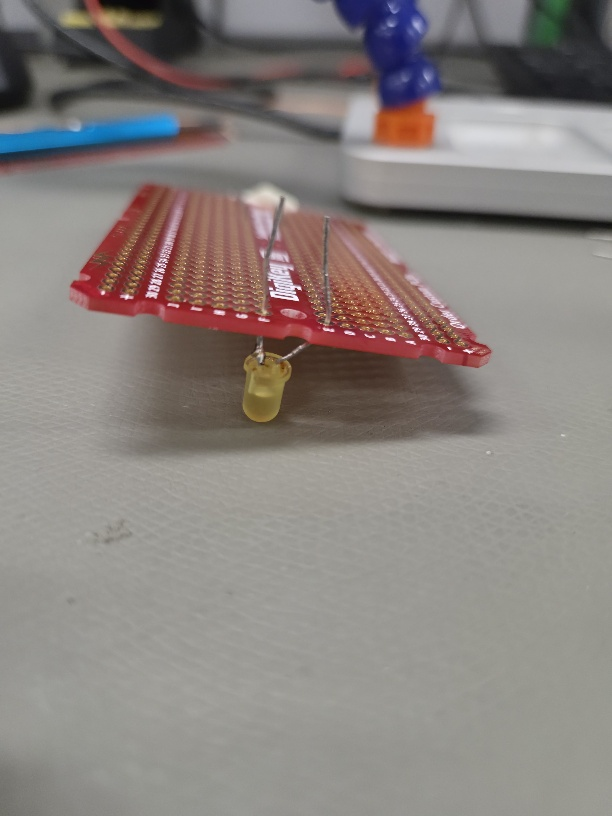
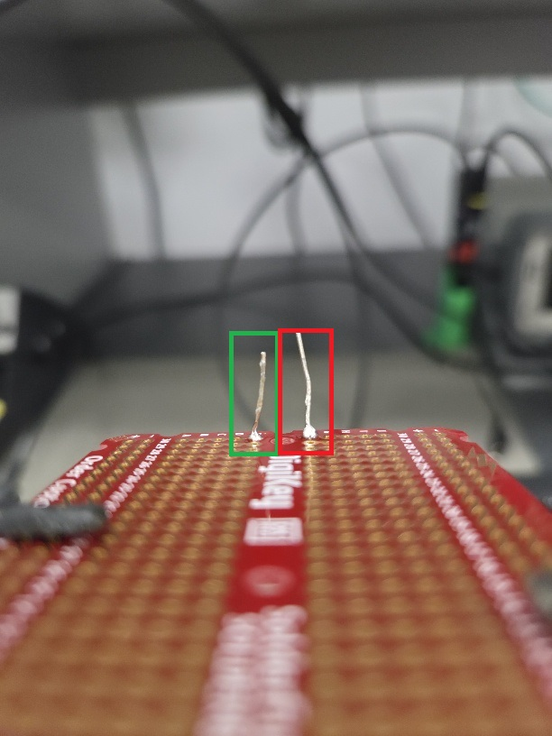
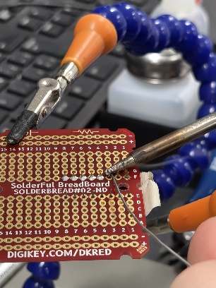
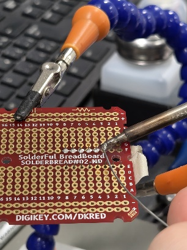
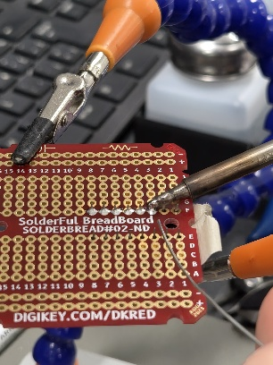
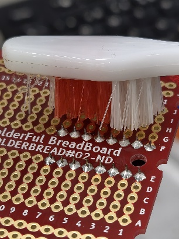

# Laboratoire 3 / Partie 1

## Partie 1:
- Soudure de composants Through-Hole

# Through-Hole

L'ensemble des gros composants sur votre PCBs sera en Through-Hole. Malgré qu'il s'agit souvent de pièces plus anciennes, certain composants resteront pour un long moment avec une variante Through-Hole (Condensateur électrolytique / Relais).

Avec votre PCBs de pratique, nous allons souder les composants suivants:

- Un TO-220 (Un 7905)
- 3 IC de type DIP
- 3 résistances Through-Hole
- 3 Condensateurs électrolytique
- Une DEL Through-Hole
- Un Header 2X10

# Tips and Tricks (Pour soudure Through-Hole)

### Maintenir son composant

Avec la soudure Through-Hole, les pièces peuvent glisser vers le bas quand vous soudez. Pour le maintenir en place:

- Plier une patte

**NOTE** Redresser toujours la patte après la soudure

- Masking Tape

- Maintenir au sol

### Soudure propre

Souder en Through-Hole est simple, mais il faut contrôler sa quantité de soudure. Contrairement à un fil, en mettre trop peut endommager le composant.

- Forme concave (Comme un chapiteau) (Gauche concave, droite convexe)

- Commencer avec du flux au besoin

- Pour le Through-Hole, assurer un contact solide avant d'appliquer la soudure

- Toujours nettoyer après, le flux core de la soudure ou la résine flux. Cela peut endommager le PCB

- Couper les excédents de pins

# Évaluation

L'évaluation de la partie 1 sera en un seul coup (Sur l'ensemble des composants)

Le but est d'avoir une soudure propre, mais aussi des composants droits.

> $\color{gray}{\text{MANIPULATION}}$ **Soudure**
>
> Souder sur le PCB de pratique les composants demandés
>
> - TO-220 (7905)
> - 3 ICs de type DIP
> - 3 résistances
> - 2 condensateurs
> - 1 DEL
> - 1 Header 2 x 10 (Couper votre 20 broches en 2, placer en parallèle)
>
> Le positionnement des composants n'est pas important. Tant qu'il y a de la place pour l'ensemble de ceux-ci
>
> Laver le PCB à l'alcool s'il y a du flux visible
>

> $\color{darkred}{\text{À VÉRIFIER}}$ **Soudure Eval**
>
> Montrer à l'enseignant les travaux de soudure
> 
> 