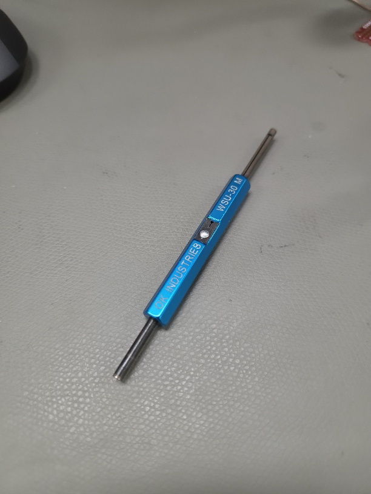
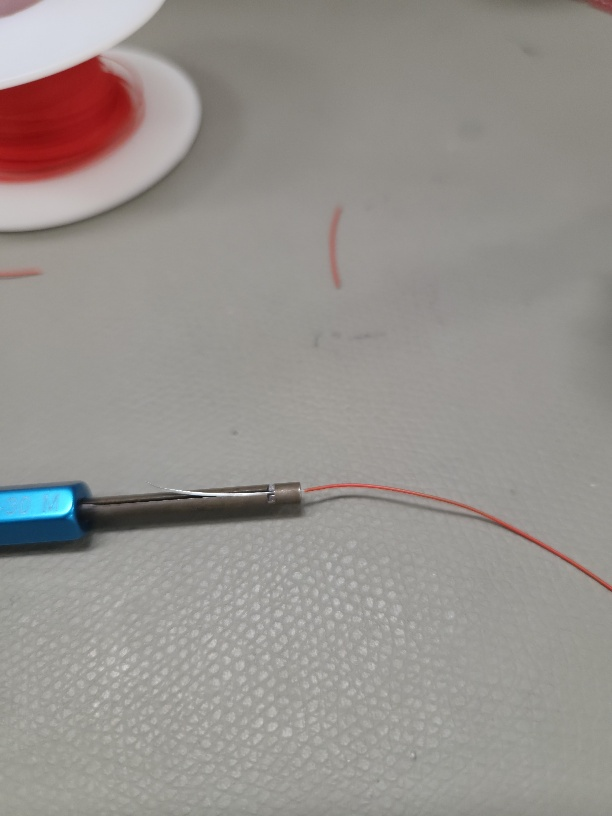
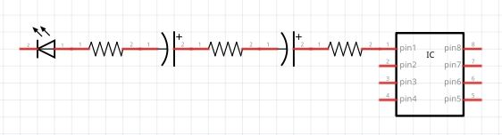
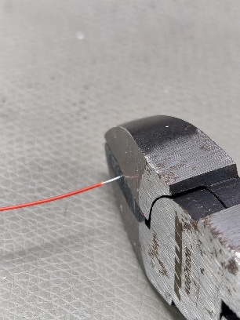
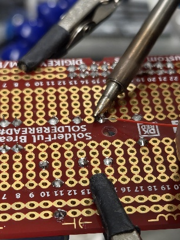
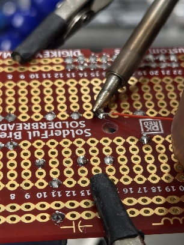
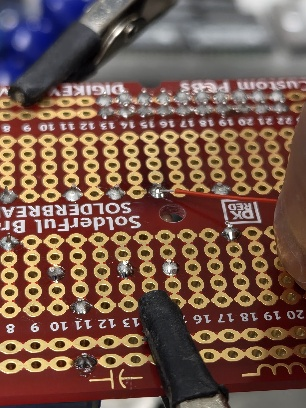
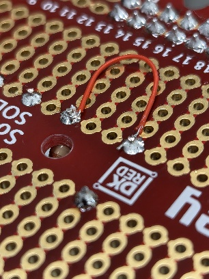

# Laboratoire 3 / Partie 2

## Partie 2:
- Wire Wrap

# Utilisation avec enroulleur

Avec du Wire Wrap (Fil monobrin de gauge AWG 30), il est important d'utiliser un dénudeur et enrouleur spécifique:

Cette outils permet de dénudeur facilement ce fil sans trop l'endommager. De plus, on peut enrouler autour de pin de format standard.

**Note** Pas besoin de faire plusieurs tours, juste assurer un maintien sans soudure

> $\color{gray}{\text{MANIPULATION}}$ **Wire Wrap 1**
>
> En utilisant les pins du Headers, utiliser le Wire Wrap et enrouler 4 pairs.
>
> N'importe quelle pairs sur le dessus de la pièce.
> 
> Aucune soudure n'est nécessaire
>

> $\color{darkred}{\text{À VÉRIFIER}}$ **Wire Wrap 1 Eval**
>
> Montrer à l'enseignant le Wire Wrapping
> 
> 

# Utilisateur sur Pad ou Via

L'usage le plus utile avec un PCB n'est cependant pas via l'enrouleur, il est principalement utilisé pour remplacer une trace.

En utilisant les pads soudés de votre PCBs de pratique, nous allons 'former' un circuit.

Votre PCBs est composer d'au moins 3 résistances, 2 condensateurs, 1 LED et un DIP

À l'aide de Wire Wrap, monter le circuit suivant:

Pour ce faire:

- Commencer de n'importe quelle DIP
- Regarder la polarité de la DEL (Avec votre multimètre au besoin)
- Regarder la direction des 2 condensateurs
- Trouver l'indicateur de 'pin 1' sur votre IC
- Utiliser du Wire Wrap dénuder au minimum

Voici comment attaché un Wire Wrap: (La soudure existant est souvent suffisante)

> $\color{gray}{\text{MANIPULATION}}$ **Wire Wrap 2**
>
> Faire le branchement ci-dessus en Wire Wrap sur votre PCBs de pratique
>
> Aucune enroulement n'est nécessaire, uniquement un peu de soudure par pad
>

> $\color{darkred}{\text{À VÉRIFIER}}$ **Wire Wrap 2 Eval**
>
> Montrer à l'enseignant les travaux de soudure
> 
> 

> $\color{darkgreen}{\text{QUESTIONS}}$ **Remettez le document questions.docx rempli via Teams**
>
> Laboratoire 3 fini!