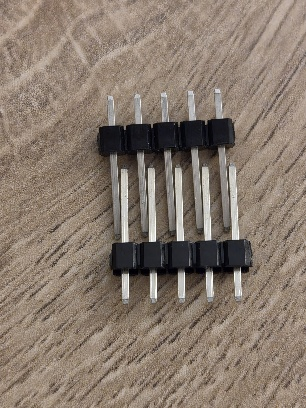

# Laboratoire 3 / Partie Extra

## Partie Extra:
- Extension bornier

# Header to Header config

Une soudure peu commune, mais tout de même utile est d'allonger des connecteurs/borniers. 

Un des cas d'utilisation est d'aligner des connecteurs qui sont fixe sur un autre board PCB sur le dessus avec des bornier du même type.

Voici comment on les connecte ensemble avant la soudure:

> $\color{gray}{\text{MANIPULATION}}$ **Header/Header**
>
> Préparer un autre Header 2x10 et souder par dessus celui sur votre PCB.
>

> $\color{darkred}{\text{À VÉRIFIER}}$ **Header eval**
>
> Montrer à l'enseignant les Headers superposés
> 
> 