# Laboratoire 4 / Partie 1

## Partie 1:
- Soudure de composants Surface Mount

# Surface Mount

L'ensemble des composants sur votre PCB sera en Surface Mount. Le PCB est un compteur avec affichage LEDs.

Le BOM (Bill of Materials) est disponible dans `pinout`, ainsi que le schéma électronique (`schematic`).

**Aller chercher un Header/connecteur 2 pins pour finaliser la soudure, à souder APRÈS le tout**

# Tips and Tricks (Pour soudure Surface-Mount)

### Préparer les composants!!

Contrairement à la soudure Through-Hole, la plupart de nos composants ici sont minuscules et peuvent tomber ou être perdu très rapidement.

Voici quelques façons pour préparer ses composants:

- Avec du masking tape, noté l'information du composant et du côté collant, place vos copie de composants.
	- Pour les prendre à nouveau, enlever-les en premier

- Avec des bols ou des diviseurs
	- Voici l'exemple pour l'ensemble des étudiants, si vous avez un kit similaire, vous pouvez en préparer un pour le laboratoire 4 et 5.

- Avec une feuille, noté l'ensemble des composants et apposé un tape pour ne pas les perdre

### LEDs??

Avec des DEL/LED, il y a une indication de la direction.

Dans le cas de nos LEDs, le tout est en dessous avec une ligne ├ (Le - est à droite ici)

Dans le cas de certains LEDs, si la tension est petite, il est possible de tester le tout avec le multimètre en mode LED/beeper

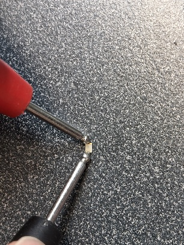

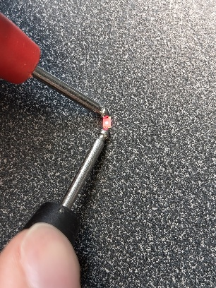

### Forme de la soudure

Pareil comme la soudure Through-Hole, on vise une forme concave si possible. Si le composant est très petit, la soudure peut monter sur le composant et enlever l'excedent peut endommager le tout. **Toujours commencer avec moins de soudure**.

Pour les pin d'un microcontrôleur, essayer aussi de former une forme concave sur les pins. **L'important ici est de ne pas trop recouvrir la pin car la soudure n'aura plus la surface de tension du metal en dessous ET pourrais court-circuité ses voisins**

### Soudure Avant

En cas de pièce à 2-3 pins, cette méthode est conseillée. Le but est de préparer un pad de soudure **AVANT** d'y mettre le composant.

Dans le cas d'un composant à 2 broches, la soudure sera du côté de votre fer à souder. 

Dans le cas d'un composant à 3 broches, même chose, mais si possible, commencer par la pin du centre en haut vers le côté de votre fer à souder.

- Placer un peu de flux

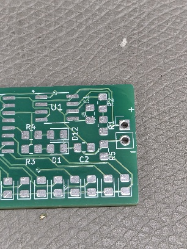

- Placer assez de soudure sur votre pad pour former un léger bulbe

**R2**
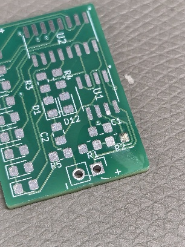

**R5**
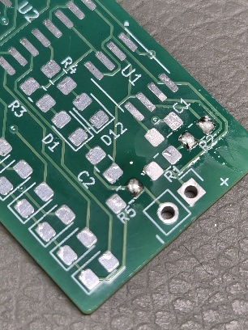

- Prendre le composant avec une paire de pince de précision

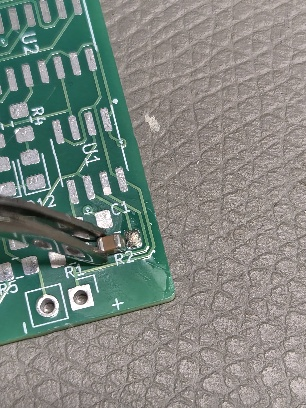

- Avec le fer à souder, maintenir sur le pad pour qu'il soit liquide

- Positionner le composant et relacher le fer quand l'orientation est droite

**Attention a placer le composant plat**

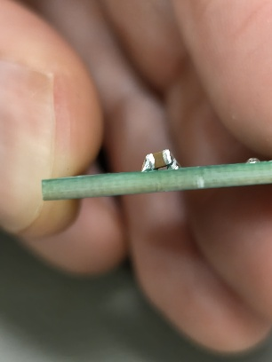

- Avec du flux, continuer les autres pads

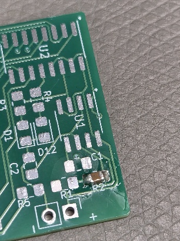

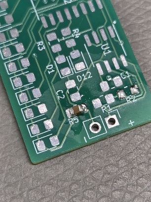

### Soudure Pin 1

Pour un module à plusieurs broches, l'important est de limiter le positionnement de votre composant. Celui-ci peut être mal aligné en rotation et en translation.

- Placer du flux

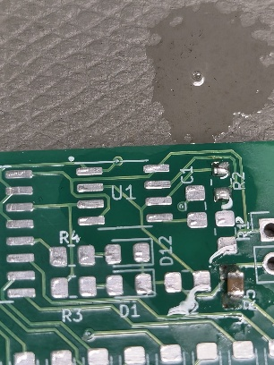

- Positionner votre composant
	- Votre composant va glisser sur le Flux, mais la suction du liquide va le maintenir plus facilement

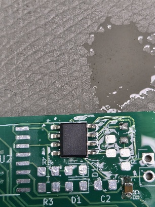

- Localiser la pin en haut sur la côté de votre fer à souder

- Préparer votre pointe avec un peu de soudure

- Avec une paire de pince, maintenir votre IC en place

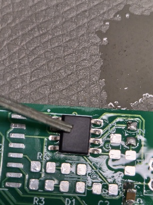

- Approcher le pointe à 45 degrée pour éviter de toucher les autres pin

- Souder la pin en haut uniquement 

- Pour solidifier, tourner votre PCB à 180 degrées et faire la même chose

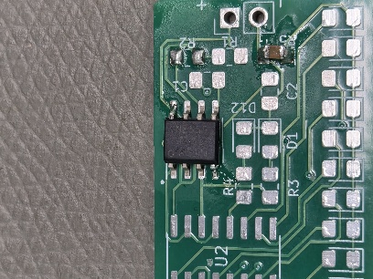

- Une fois le circuit bien en place, remettre du flux et avec un **PEU** de soudure, connecter l'ensemble des traces

**Ici, voici le MAXIMUM de soudure sur les pins**

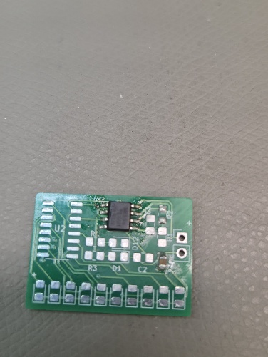

### Clean-up et shorts

Vos 2 outils pour cleaner le tout sont l'alcool ET la tresse à dessouder.

Ne pas frotter trop fort avec la brosse sur les DELs, le tout est en plastique, et endommager la lentille va affecter la qualité d'éclairage.

La tresse est utilisée pour enlever les court-circuits. Si trop de soudure à été enlever, n'oublier pas d'en ajouter à nouveau!

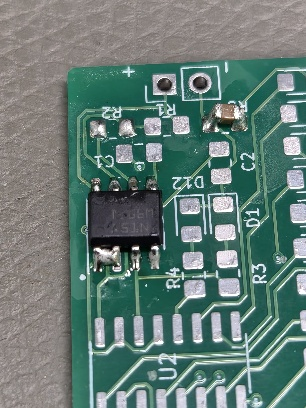

# Évaluation

L'évaluation de la partie 1 sera en un seul coup (Sur l'ensemble des composants)

Le but est d'avoir une soudure propre, mais aussi des composants droits.

> $\color{gray}{\text{MANIPULATION}}$ **Soudure**
>
> Souder l'ensemble des composants du BOMs
>
>
> Laver le PCB à l'alcool s'il y a du flux visible
>

> $\color{darkred}{\text{À VÉRIFIER}}$ **Soudure Eval**
>
> Montrer à l'enseignant les travaux de soudure
> 
> 