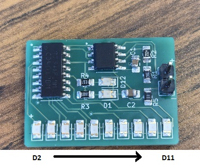
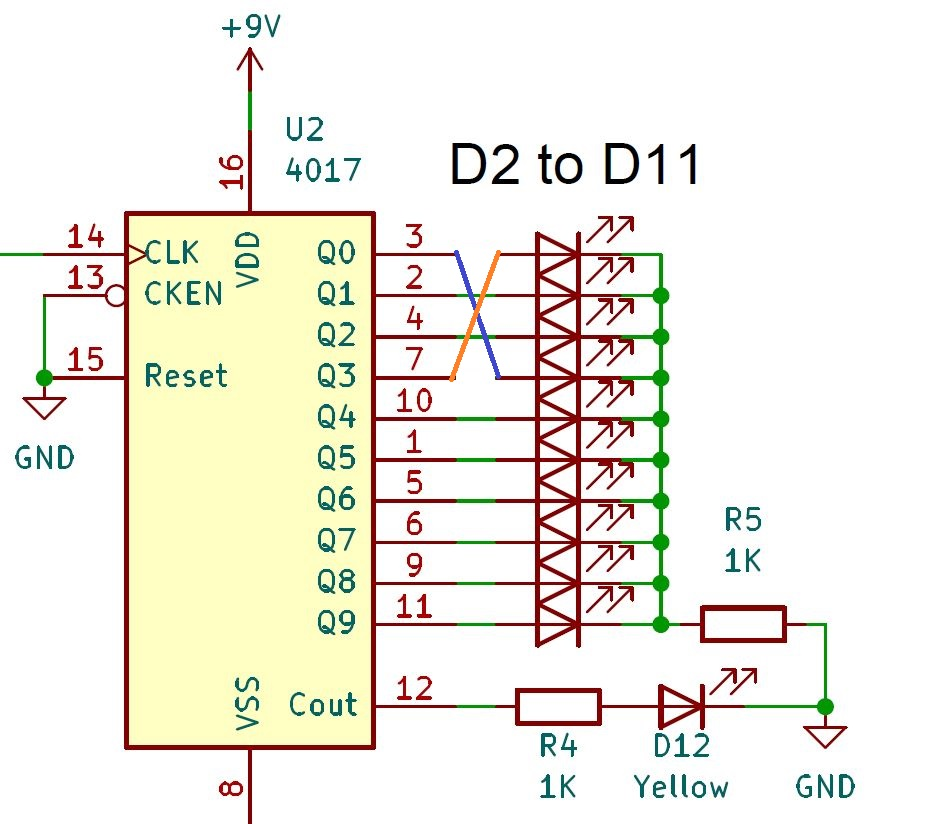
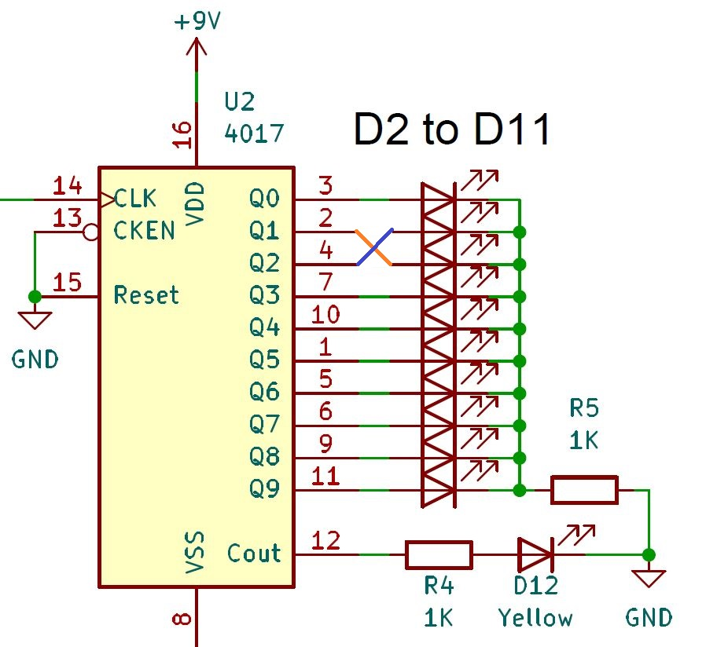
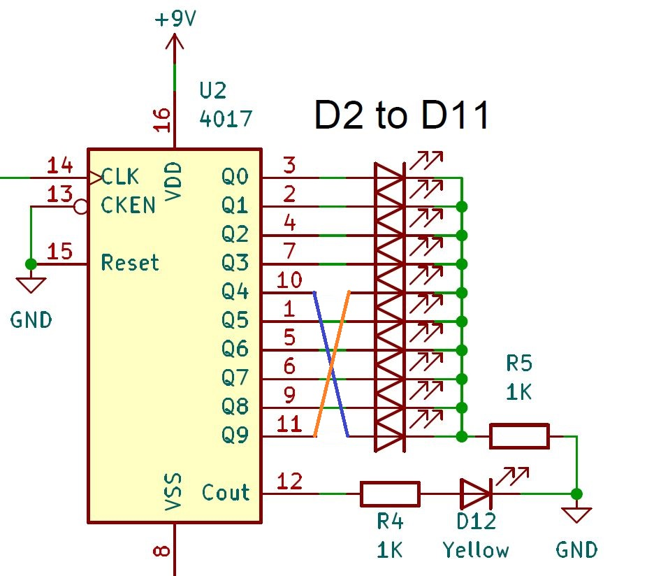
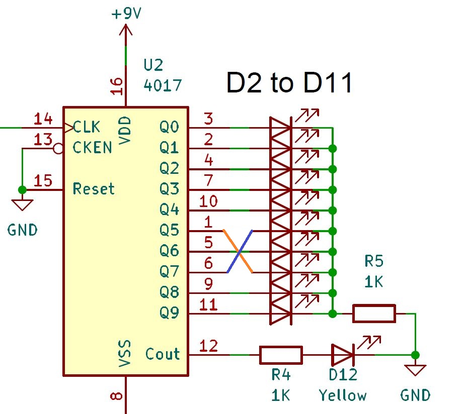

# Laboratoire 6 / Partie 1

## Partie 1:
- Mise à jour

## Intro

Dans ce laboratoire, vous devez avoir au moins un PCB compteur fonctionnel.

Pour être fonctionnel, CHACUNE des DELs doit fonctionner. Si la vitesse de balayage n'est pas la même que le restant du groupe, l'unité est quand même fonctionnel, mais aller voir l'enseignant pour ajouter une note si vous prenez la modification avec le 555.

Le but du laboratoire est simple, mettre à jour votre PCB en suivant les nouvelles demandes. Dans le cadre d'un emploi, les modifications seront moins nombreuses que ceux ici, mais peuvent être aussi dommageable que ceux-ci. 

Dans le but de noter le tout, montrer à l'enseignant **CHAQUE** modification une à la fois. La raison est qu'il est fort peu probable que votre circuit puissent survivre l'ensemble des modifications.

L'ensemble des modifications doit être noté sur votre $\color{darkgreen}{\text{questions.docx}}$

Voici le format:

| Sélection | Description de la mise à jour                                                                                                                                                              | Pondération | Fonctionnel? (Y/N) |
| --------- | ------------------------------------------------------------------------------------------------------------------------------------------------------------------------------------------ | ----------- | ------------------ |
|           | Inverser D2 et D5                                                                                                                                                                          | 1           |                    |
|           | Inverser D3 et D4                                                                                                                                                                          | 1           |                    |
|           | Inverser D6 et D11                                                                                                                                                                         | 1           |                    |
|           | Inverser D7 et D9                                                                                                                                                                          | 1           |                    |
|           | Inverser D8 et D10                                                                                                                                                                         | 1           |                    |
|           | Changer D1 et D12 pour des LEDs verte                                                                                                                                                      | 1           |                    |
|           | Vitesse autour de X4 pour le 555                                                                                                                                                           | 2           |                    |
|           | Couper l’entrée de l’onde carré dans le 4017, connecter un header 3 pin, à l’aide d’un jumper sélectionner si l’entrée du 4017 est le 555 OU une onde carré venant d’ailleurs (Voir image) | 2           |                    |
|           | CE du 4017 déconnecté du GND et connecté via un Header 3 pin. À l’aide d’un jumper, choisir le le CE est 1) reconnecté au GND ou 2) au choix sur l’autre pin (Voir image)                  | 2           |                    |
|           | Via pièce surface mount, ajouter une DEL verte (Et une resistance de 1k) pour savoir si l’alimentation est bien fonctionnel                                                                | 2           |                    |

Certaine modification sont simple (Pondération à 1 point), d'autres sont compliqué (Pondération à 2 points). Pour avoir la note maximale, vous devez avoir 8 mise à jour et un circuit fonctionnel.

Pour la note d'évaluation, l'ensemble du circuit avec les dernières mise à jours doit ausssi fonctionner. Voici donc l'échelle:

- 1 Point de Pondération: **30%**
- 2 Points de Pondération: **45%**
- 3 Points de Pondération: **60%**
- 4 Points de Pondération: **70%**
- 5 Points de Pondération: **82%**
- 6 Points de Pondération: **89%**
- 7 Points de Pondération: **95%**
- 8 Points de Pondération: **100%**
- (Extra) +9 Points de Pondération: ***105%***

**NOTE**: Pour avoir un succès, il suffit de montrer le fonctionnement, la qualité du fillage ou soudure n'est pas évaluée. Je vous conseille tout de même de faire un travail propre parce que les travaux subséquents seront difficile.

## Modification sur la ***schematic*** et images au besoin

Voici chacune des modifications sur la schéma électrique:

#### Inverser D2 et D5 

Les DELs/LEDs ne sont pas annoté sur le PCB, voici l'ordre:

Voici la modification:

#### Inverser D3 et D4  

Les DELs/LEDs ne sont pas annoté sur le PCB, voici l'ordre:

Voici la modification:

#### Inverser D6 et D11  

Les DELs/LEDs ne sont pas annoté sur le PCB, voici l'ordre:

Voici la modification:

#### Inverser D7 et D9  

Les DELs/LEDs ne sont pas annoté sur le PCB, voici l'ordre:

Voici la modification:

#### Inverser D8 et D10 

Les DELs/LEDs ne sont pas annoté sur le PCB, voici l'ordre:

Voici la modification:

#### Changer D1 et D12 pour des LEDs verte 

#### Vitesse autour de X4 pour le 555 

#### Couper l’entrée de l’onde carré dans le 4017

#### CE du 4017

#### Ajouter une DEL verte à l'alimentation

# Évaluation

**N'OUBLIEZ PAS DE MONTRER CHAQUE ÉTAPE**

> $\color{gray}{\text{MANIPULATION}}$ **Montrer une étape**
>
> Faire votre modification à l'aide de Wire-wrap, soudure ou dessouder des composants
>

> $\color{darkred}{\text{À VÉRIFIER}}$ **Eval**
>
> Montrer à l'enseignant le fonctionnement (Pas la qualité des travaux)
> 
> 
